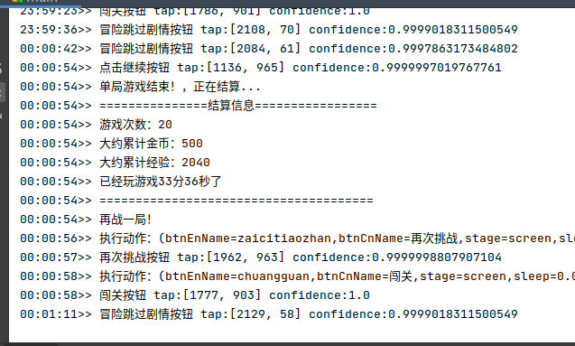

# 王者荣耀辅助助手

解放双手打资源，实现3个目标：
* 刷金币
* 刷经验
* 刷等级

以上3个目标，游戏一经开始，不用再管，我们该干嘛就干嘛去吧。


**效果图：**


软件界面：


控制台：




**实现思路：**

1. python + adb（手机usb调试模式） + aircv图像识别 + tkinter界面

2. 冒险模式、六国远征这些模式本来就带有自动打怪功能


**使用方式：**

1. 手机需要打开开发者模式，并使用usb线连接到电脑（慎重考虑）。

2. 电脑端需要安装android调试桥工具adb。

      adb devices命令确保有连接上的设备。

3. 运行这个python王者荣耀辅助助手。


**支持的模式有**：

​	<span style="color:red">注意：要将万象天宫页面中，“冒险玩法”添加到我的收藏“快捷入口”中</span>

- 冒险模式

  ​	已经试了很多次了，很稳定了，相当爽，腾讯限量的金币要不了好久就刷完了。

  ```python
  if __name__ == '__main__':
      GameEmulator().showGameList().selectMaoXianWanFa().startGame()
  ```
  
- 六国远征

  ​	还不是很完美，基本可以使用

```python
    if __name__ == '__main__':
        GameEmulator().showGameList().selectLiuGuoYuanZhen().startGame()
```

- 敬请期待...


**5种使用方式：**

```python
    # 5种模式开始模式
    gameEmulator.startGame()  # 无限制，一直打下去(提示：腾讯有健康时长，久了会禁赛，金币每周也是有上限的)
    # gameEmulator.startGame(GameStopCondition.TIMES, 1000) # 玩1000把游戏
    # gameEmulator.startGame(GameStopCondition.COINS, 5000) # 打5000金币
    # gameEmulator.startGame(GameStopCondition.EXPR, 10000) # 打10000经验
    # gameEmulator.startGame(GameStopCondition.TIME_SECOND, 6 * 60 * 60) # 玩6个小时游戏
```


**为什么要做这个程序出来？**

1. 学习python。以前入门过python，能用Scrapy抓取我感兴趣的内容，但是有一两年没用，python感觉又忘得差不多了。
2. 玩游戏啦。突发奇想能不能通过程序控制手机自己玩，实现一个帮助自己玩游戏的助手，又可以为我节约时间。个人曾经无数次抛弃不玩游戏，但是最终又玩起来游戏，可能还是比较喜欢吧（明知道这个是一件费时间又对个人没有收益的事情）。

依赖库：
pip3 install -r requirements.txt

## 对于项目发展的思考

​		这个项目，最大的一快好处是依赖了游戏本身的自动游戏，但是如果去玩人机模式这种没有自动模式的关卡，我们该如何实现呢？

- 用一个数据文件记录在不同时间完成的游戏行为，什么时候点击技能，什么时候回血，什么时候怎么样移动（当然只是去野区打野怪的脚本，当个混子，直到队友完成游戏，一并获取当局奖励）。

- 使用adb shell getevent来录制带时间戳的脚本，然后使用adb shell sendevent来回放脚本的内容（当然也仅限在野区中活动）。

  ​	这个我简单试了一下，好像有权限问题。不知道是要root还是android从哪个版本就禁止使用这个功能了，我时间有限，暂时没空研究了，这个思路是非常好的，记录下来。
  
- 目前只支持android，能不能支持下ios。

